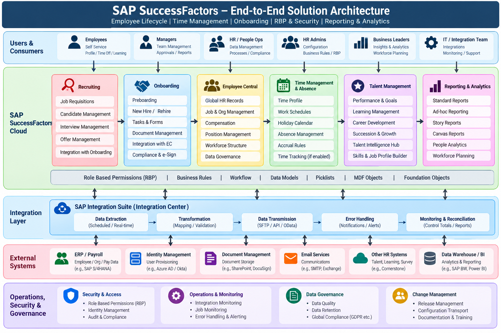

# SAP SuccessFactors Architecture

A practical architecture portfolio focused on designing scalable, secure, maintainable SAP SuccessFactors solutions across **Employee Central, Onboarding 2.0, Time Management, Talent Intelligence Hub, Reporting, Security, and Integrations**.

> **Architecture is not configuration in isolation. It is the design of how business processes, data ownership, security, rules, reporting, and integrations work together.**

## End-to-End Reference Architecture

## What this repository demonstrates

- End-to-end employee lifecycle architecture
- System-of-record and data ownership decisions
- Effective-dated design
- Onboarding and Employee Central integration patterns
- Time Off and policy-driven business-rule architecture
- RBP and target-population governance
- Reporting and analytics architecture
- Integration validation, monitoring, and reconciliation
- Architecture Decision Records (ADRs)
- Public-safe solution design and implementation patterns

## Architecture Domains

| Domain | Focus |
|---|---|
| Employee Lifecycle | Hire, rehire, employment changes and downstream lifecycle |
| Onboarding | Onboarding 2.0 orchestration, forms, compliance and handoff to EC |
| Employee Central | Employee master, employment, job and organizational data |
| Time Management | Time profiles, eligibility, accruals, balances and validations |
| Security / RBP | Permission roles, target populations and access governance |
| Reporting & Analytics | Story, Canvas, People Analytics and BI patterns |
| Business Rules | Trigger, ownership, inputs, effective dating and exception handling |
| Integrations | Extraction, validation, transformation, transmission and reconciliation |

## Architecture Mindset

1. Start with the business process.
2. Identify the system of record.
3. Define data ownership.
4. Treat effective dating as a first-class design attribute.
5. Prefer standard functionality before custom logic.
6. Keep business rules single-purpose and explainable.
7. Separate security permissions from target populations.
8. Design failure paths, monitoring and reconciliation—not only the happy path.

## Reference Solution Landscape

**Business Event → Onboarding → Employee Central → Time / Talent → Reporting & Analytics → Integration → Downstream Systems**

Cross-cutting controls:

**RBP + Business Rules + Effective Dating + Data Governance + Monitoring + Reconciliation**

## Solution Lifecycle

**Discover → Design → Configure → Integrate → Validate → Deploy → Monitor → Improve**

Each stage should maintain traceability from the business requirement to the resulting configuration, integration, reporting, and support model.

## Case Studies

- [Statutory Accrual Architecture](statutory-accrual-architecture.md)
- [Rehire Lifecycle Architecture](rehire-lifecycle-architecture.md)
- [RBP Reporting Governance](rbp-reporting-governance.md)

## Architecture Decision Records

- [ADR-001 — Effective-Dated Lifecycle](ADR-001-effective-dated-lifecycle.md)
- [ADR-002 — Business Rule Ownership](ADR-002-business-rule-ownership.md)
- [ADR-003 — Integration Reconciliation](ADR-003-integration-reconciliation.md)

## Reference Architecture

- [Reference Architecture](reference-architecture.md)
- [End-to-End Solution Design](solution-design.md)
- [Architecture Diagram Source](architecture-diagram.mmd)

## Architecture Principles

- [Architecture Principles](architecture-principles.md)
- [Employee Lifecycle](employee-lifecycle.md)
- [Time Management](time-management.md)
- [Onboarding](onboarding.md)
- [Security & RBP](security-rbp.md)
- [Reporting & Analytics](reporting-analytics.md)
- [Business Rules](business-rules.md)
- [Integration Patterns](integration-patterns.md)
- [Rehire Design](rehire-design.md)
- [Accrual Design](accrual-design.md)

## Architecture Decision Test

Before considering a solution complete, ask:

1. What is the system of record?
2. What event starts the process?
3. When does the business state become effective?
4. Who owns the business decision?
5. Which population is affected?
6. What happens when the normal path fails?
7. How is the result reported?
8. How is downstream processing reconciled?

## About This Repository

This is a **public-safe architecture portfolio**. It intentionally excludes client-specific configuration, confidential data, production identifiers, credentials, proprietary mappings, and other restricted implementation details.

The examples are intended to demonstrate architecture thinking, solution design, governance, and implementation patterns rather than expose customer-specific environments.
